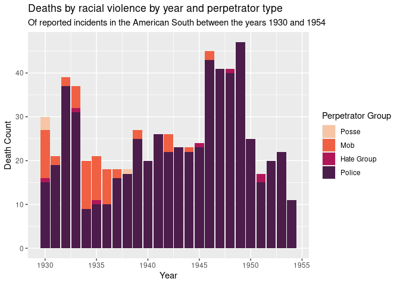

This document should contain a detailed account of the data clean up for your data and the design choices you are making for your plots. For instance you will want to document choices you've made that were intentional for your graphic, e.g. color you've chosen for the plot. Think of this document as a code script someone can follow to reproduce the data cleaning steps and graphics in your handout.


``` r
library(tidyverse)
library(broom)
library(tidyverse)
library(readr)
library(ggridges)
library(ggplot2)
library(usmap)
library(dplyr)
library(tigris)
library(stringr)
library(leaflet)
library(sf)
library(visdat)
library(naniar)
library(UpSetR)
library(devtools)
#devtools::install_github("hrbrmstr/streamgraph")
library(RColorBrewer)
library(viridis)
```

## Data Clean Up Steps for Overall Data

### Step 1: Uploading main dataset and FIPS geographic data

``` r
victims_incidents <- read_csv("../data/victims_incidents.csv")
```

```
## Rows: 955 Columns: 42
## ── Column specification ────────────────────────────────────────────────────────
## Delimiter: ","
## chr (20): name, alternate_names, sex, race, date_of_death, military_service_...
## dbl  (8): person_id, age, incident_id, incident_year_range_beg, incident_yea...
## lgl (14): active_duty, veteran, prisoner, perp_group_police, perp_group_poss...
## 
## ℹ Use `spec()` to retrieve the full column specification for this data.
## ℹ Specify the column types or set `show_col_types = FALSE` to quiet this message.
```

``` r
fips_data <- tigris::counties(state = "Alabama", class = "sf") %>%
  select(fips = GEOID, county = NAME) #load fips data
```

```
## Retrieving data for the year 2022
```

```
## 
  |                                                                            
  |                                                                      |   0%
  |                                                                            
  |                                                                      |   1%
  |                                                                            
  |=                                                                     |   1%
  |                                                                            
  |=                                                                     |   2%
  |                                                                            
  |==                                                                    |   3%
  |                                                                            
  |===                                                                   |   4%
  |                                                                            
  |===                                                                   |   5%
  |                                                                            
  |====                                                                  |   6%
  |                                                                            
  |=====                                                                 |   7%
  |                                                                            
  |=====                                                                 |   8%
  |                                                                            
  |======                                                                |   9%
  |                                                                            
  |=======                                                               |  10%
  |                                                                            
  |========                                                              |  11%
  |                                                                            
  |========                                                              |  12%
  |                                                                            
  |=========                                                             |  13%
  |                                                                            
  |==========                                                            |  14%
  |                                                                            
  |==========                                                            |  15%
  |                                                                            
  |===========                                                           |  16%
  |                                                                            
  |============                                                          |  17%
  |                                                                            
  |=============                                                         |  18%
  |                                                                            
  |=============                                                         |  19%
  |                                                                            
  |==============                                                        |  20%
  |                                                                            
  |===============                                                       |  21%
  |                                                                            
  |===============                                                       |  22%
  |                                                                            
  |================                                                      |  23%
  |                                                                            
  |=================                                                     |  24%
  |                                                                            
  |==================                                                    |  25%
  |                                                                            
  |==================                                                    |  26%
  |                                                                            
  |===================                                                   |  27%
  |                                                                            
  |====================                                                  |  28%
  |                                                                            
  |====================                                                  |  29%
  |                                                                            
  |=====================                                                 |  30%
  |                                                                            
  |======================                                                |  31%
  |                                                                            
  |=======================                                               |  32%
  |                                                                            
  |=======================                                               |  33%
  |                                                                            
  |========================                                              |  34%
  |                                                                            
  |=========================                                             |  35%
  |                                                                            
  |=========================                                             |  36%
  |                                                                            
  |==========================                                            |  37%
  |                                                                            
  |===========================                                           |  38%
  |                                                                            
  |============================                                          |  39%
  |                                                                            
  |============================                                          |  40%
  |                                                                            
  |=============================                                         |  42%
  |                                                                            
  |==============================                                        |  43%
  |                                                                            
  |==============================                                        |  44%
  |                                                                            
  |===============================                                       |  45%
  |                                                                            
  |================================                                      |  46%
  |                                                                            
  |=================================                                     |  47%
  |                                                                            
  |=================================                                     |  48%
  |                                                                            
  |==================================                                    |  49%
  |                                                                            
  |===================================                                   |  50%
  |                                                                            
  |====================================                                  |  51%
  |                                                                            
  |====================================                                  |  52%
  |                                                                            
  |=====================================                                 |  53%
  |                                                                            
  |======================================                                |  54%
  |                                                                            
  |======================================                                |  55%
  |                                                                            
  |=======================================                               |  56%
  |                                                                            
  |========================================                              |  57%
  |                                                                            
  |=========================================                             |  58%
  |                                                                            
  |=========================================                             |  59%
  |                                                                            
  |==========================================                            |  60%
  |                                                                            
  |===========================================                           |  61%
  |                                                                            
  |===========================================                           |  62%
  |                                                                            
  |============================================                          |  63%
  |                                                                            
  |=============================================                         |  64%
  |                                                                            
  |==============================================                        |  65%
  |                                                                            
  |==============================================                        |  66%
  |                                                                            
  |===============================================                       |  67%
  |                                                                            
  |================================================                      |  68%
  |                                                                            
  |================================================                      |  69%
  |                                                                            
  |=================================================                     |  70%
  |                                                                            
  |==================================================                    |  71%
  |                                                                            
  |===================================================                   |  72%
  |                                                                            
  |===================================================                   |  73%
  |                                                                            
  |====================================================                  |  74%
  |                                                                            
  |=====================================================                 |  75%
  |                                                                            
  |=====================================================                 |  76%
  |                                                                            
  |======================================================                |  77%
  |                                                                            
  |=======================================================               |  78%
  |                                                                            
  |========================================================              |  79%
  |                                                                            
  |========================================================              |  80%
  |                                                                            
  |=========================================================             |  82%
  |                                                                            
  |==========================================================            |  83%
  |                                                                            
  |==========================================================            |  84%
  |                                                                            
  |===========================================================           |  85%
  |                                                                            
  |============================================================          |  86%
  |                                                                            
  |=============================================================         |  87%
  |                                                                            
  |=============================================================         |  88%
  |                                                                            
  |==============================================================        |  89%
  |                                                                            
  |===============================================================       |  90%
  |                                                                            
  |================================================================      |  91%
  |                                                                            
  |================================================================      |  92%
  |                                                                            
  |=================================================================     |  93%
  |                                                                            
  |==================================================================    |  94%
  |                                                                            
  |==================================================================    |  95%
  |                                                                            
  |===================================================================   |  96%
  |                                                                            
  |====================================================================  |  97%
  |                                                                            
  |===================================================================== |  98%
  |                                                                            
  |===================================================================== |  99%
  |                                                                            
  |======================================================================| 100%
```

### Step 2: Adding a "perp_group" column based on the four individual true/false columns for perp type. 


``` r
victims_incidents <- victims_incidents %>%
  mutate(perp_group = case_when(
    perp_group_police == TRUE ~ "police",
    perp_group_posse == TRUE ~ "posse",
    perp_group_hate == TRUE ~ "hate",
    perp_group_mob == TRUE ~ "mob",
    TRUE ~ NA_character_
  ))
```

### Step 3: Create a count of incident total by each state 

``` r
incident_count <- victims_incidents %>%
  group_by(state) %>%
  summarize(incident_total = n())
```


## Plots

#### Final Plot 1: Incident count by perpetrator group and year


``` r
victims_incidents <- victims_incidents %>% 
  drop_na(perp_group)

victims_incidents$perp_group <- factor(victims_incidents$perp_group, levels = c("posse", "mob", "hate", "police"))

red_palette <- viridis(4, option = "F", begin = 0.2, end = 0.9)
red_palette <- rev(red_palette)

ggplot(victims_incidents, aes(
  incident_year_range_end, fill = perp_group)) +
  geom_bar() +
  labs(
    title = "Deaths by racial violence by year and perpetrator type",
    subtitle = "Of reported incidents in the American South between the years 1930 and 1954",
    y = "Death Count",
    x = "Year"
  ) +
  scale_fill_manual(
    name = "Perpetrator Group",
    labels = c("Posse", "Mob", "Hate Group", "Police"),
    values = red_palette
  ) +
  theme(
    panel.background = element_rect(fill = "#ebebeb"), 
    legend.position = "right")
```

```
## Warning: Removed 2 rows containing non-finite outside the scale range
## (`stat_count()`).
```

<!-- -->

``` r
#to save image
ggsave("Death_year_perp_final.png", width = 8, height = 5)
```

```
## Warning: Removed 2 rows containing non-finite outside the scale range
## (`stat_count()`).
```


### Plot 2: Spaghettis

### Plot 3: ___________

Add more plot sections as needed. Each project should have at least 3 plots, but talk to me if you have fewer than 3.

### Plot 4: ___________ 


