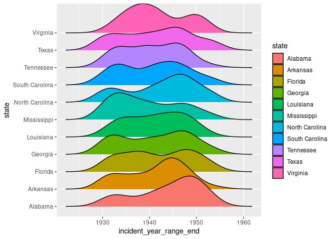

Project proposal
================
MEG

``` r
library(tidyverse)
library(broom)
library(readr)
library(ggridges)
library(ggplot2)
```

## 1. Introduction

## 2. Data

``` r
victims_incidents <- read_csv("../data/victims_incidents.csv")
```

    ## Rows: 955 Columns: 42
    ## ── Column specification ────────────────────────────────────────────────────────
    ## Delimiter: ","
    ## chr (20): name, alternate_names, sex, race, date_of_death, military_service_...
    ## dbl  (8): person_id, age, incident_id, incident_year_range_beg, incident_yea...
    ## lgl (14): active_duty, veteran, prisoner, perp_group_police, perp_group_poss...
    ## 
    ## ℹ Use `spec()` to retrieve the full column specification for this data.
    ## ℹ Specify the column types or set `show_col_types = FALSE` to quiet this message.

``` r
glimpse(victims_incidents)
```

    ## Rows: 955
    ## Columns: 42
    ## $ person_id                 <dbl> 167, 124, 4, 586, 1146, 840, 704, 291, 951, …
    ## $ name                      <chr> "Claude Neal", "Cellos Harrison", "A. C. Wil…
    ## $ alternate_names           <chr> NA, NA, NA, NA, "Willie Jones Howell, Jr", "…
    ## $ sex                       <chr> "m", "m", "m", "m", "m", "m", "m", "m", "m",…
    ## $ race                      <chr> "African American", "African American", "Afr…
    ## $ age                       <dbl> NA, NA, NA, NA, 15, 21, 43, 31, 30, NA, 30, …
    ## $ date_of_death             <chr> "10/27/34", "6/16/43", "5/12/41", "10/11/45"…
    ## $ active_duty               <lgl> NA, NA, NA, NA, NA, NA, NA, NA, NA, NA, NA, …
    ## $ veteran                   <lgl> NA, NA, NA, TRUE, NA, NA, TRUE, TRUE, NA, NA…
    ## $ military_service_details  <chr> NA, NA, NA, NA, NA, NA, NA, "World War II", …
    ## $ occupation                <chr> "farm worker", NA, NA, "sharecropper", "dime…
    ## $ occupation_sectors        <chr> "agricultural", NA, NA, "agricultural", "ser…
    ## $ prisoner                  <lgl> NA, NA, NA, NA, NA, NA, NA, NA, NA, NA, NA, …
    ## $ incident_id               <dbl> 9, 10, 11, 12, 13, 14, 15, 16, 17, 18, 19, 2…
    ## $ case_abstract             <chr> "Claude Neal, a farm worker, was killed by a…
    ## $ incident_date             <chr> "10/26/34", "6/16/43", "5/12/41", "10/11/45"…
    ## $ incident_date_approx      <chr> NA, NA, NA, NA, NA, NA, NA, NA, NA, NA, NA, …
    ## $ incident_year_range_beg   <dbl> 1934, 1943, 1941, 1945, 1944, 1938, 1939, 19…
    ## $ incident_year_range_end   <dbl> 1934, 1943, 1941, 1945, 1944, 1938, 1939, 19…
    ## $ city                      <chr> "Marianna", "Marianna", "Quincy", NA, "Live …
    ## $ county                    <chr> "Jackson County", "Jackson County", "Gadsden…
    ## $ state                     <chr> "Florida", "Florida", "Florida", "Florida", …
    ## $ geonames_id_city          <dbl> 4163428, 4163428, 4169510, NA, 4162461, 4168…
    ## $ geonames_id_county        <dbl> 4159990, 4159990, 4156394, 4163142, 4174543,…
    ## $ geonames_id_state         <dbl> 4155751, 4155751, 4155751, 4155751, 4155751,…
    ## $ location_type             <chr> "unknown - rural", "public space - rural", "…
    ## $ allegation_against_victim <chr> "raping and murdering a white woman", "murde…
    ## $ perp_group_police         <lgl> NA, TRUE, NA, NA, NA, TRUE, NA, TRUE, NA, TR…
    ## $ perp_group_posse          <lgl> NA, NA, NA, NA, NA, NA, NA, NA, NA, NA, NA, …
    ## $ perp_group_mob            <lgl> TRUE, NA, NA, NA, NA, TRUE, NA, NA, TRUE, NA…
    ## $ perp_group_hate           <lgl> NA, NA, NA, NA, NA, NA, NA, NA, NA, NA, NA, …
    ## $ coroner_inquest           <lgl> NA, TRUE, TRUE, TRUE, TRUE, TRUE, TRUE, TRUE…
    ## $ exoneration               <lgl> NA, TRUE, TRUE, TRUE, TRUE, TRUE, FALSE, FAL…
    ## $ grand_jury                <lgl> TRUE, TRUE, NA, TRUE, TRUE, TRUE, TRUE, TRUE…
    ## $ charge                    <lgl> NA, NA, NA, NA, NA, NA, TRUE, NA, NA, NA, NA…
    ## $ arrest                    <lgl> NA, NA, NA, NA, NA, NA, TRUE, TRUE, NA, NA, …
    ## $ trial                     <lgl> NA, NA, NA, NA, NA, NA, TRUE, TRUE, NA, NA, …
    ## $ conviction                <lgl> NA, NA, NA, NA, NA, NA, FALSE, FALSE, NA, NA…
    ## $ sentence                  <chr> NA, NA, NA, NA, NA, NA, NA, NA, NA, NA, NA, …
    ## $ case_id_fbi               <chr> NA, "Miami 44-70||Bureau 44-801||Miami 44-84…
    ## $ case_id_doj               <chr> "144-17-792", "144-17-3", NA, "144-67-9||144…
    ## $ alleged_perpetrators      <chr> "George Cannidy||\"Peg Leg\" Brown||Bowen Gr…

## 3. Data analysis plan

In a choropleth map with bar chart we are hoping to visualize these
variables:

Density of incidents Date (Year) Gender County

In a bar chart we are hoping to visualize these variables: Perpetrator
type Conviction

We were considering researching laws in different areas, as they may be
significant in swaying the outcome to

The preliminary data analysis shows there are variations in the amount
of victims based on gender throughout time. It also shows that there is
variation in the number of incidents in each state throughout time.

``` r
names(victims_incidents)
```

    ##  [1] "person_id"                 "name"                     
    ##  [3] "alternate_names"           "sex"                      
    ##  [5] "race"                      "age"                      
    ##  [7] "date_of_death"             "active_duty"              
    ##  [9] "veteran"                   "military_service_details" 
    ## [11] "occupation"                "occupation_sectors"       
    ## [13] "prisoner"                  "incident_id"              
    ## [15] "case_abstract"             "incident_date"            
    ## [17] "incident_date_approx"      "incident_year_range_beg"  
    ## [19] "incident_year_range_end"   "city"                     
    ## [21] "county"                    "state"                    
    ## [23] "geonames_id_city"          "geonames_id_county"       
    ## [25] "geonames_id_state"         "location_type"            
    ## [27] "allegation_against_victim" "perp_group_police"        
    ## [29] "perp_group_posse"          "perp_group_mob"           
    ## [31] "perp_group_hate"           "coroner_inquest"          
    ## [33] "exoneration"               "grand_jury"               
    ## [35] "charge"                    "arrest"                   
    ## [37] "trial"                     "conviction"               
    ## [39] "sentence"                  "case_id_fbi"              
    ## [41] "case_id_doj"               "alleged_perpetrators"

``` r
dim(victims_incidents)
```

    ## [1] 955  42

``` r
ggplot(victims_incidents, aes(
  sex))+
  geom_bar()
```

<!-- -->

``` r
victims_incidents<-victims_incidents|>
  drop_na(sex)
ggplot(victims_incidents, aes(
  incident_year_range_end, fill=sex))+
  geom_bar()
```

    ## Warning: Removed 3 rows containing non-finite outside the scale range
    ## (`stat_count()`).

<!-- -->

``` r
ggplot(victims_incidents, aes(
  incident_year_range_end, state, fill=state))+
  geom_density_ridges()
```

    ## Picking joint bandwidth of 2.59

    ## Warning: Removed 3 rows containing non-finite outside the scale range
    ## (`stat_density_ridges()`).

<!-- -->

## 4. Data Ethics Review

The data ethics review section will be introduced in a separate class
and is not part of the original proposal deadline.
